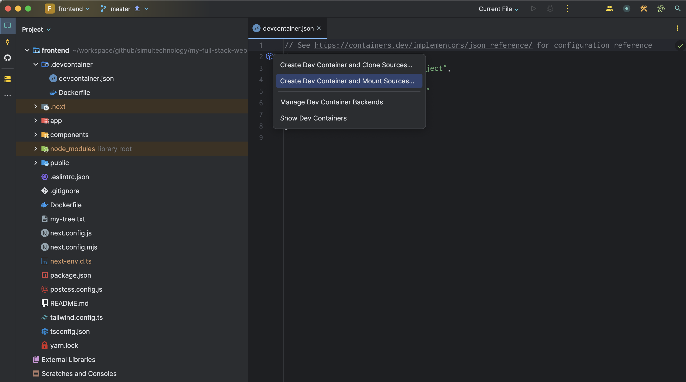
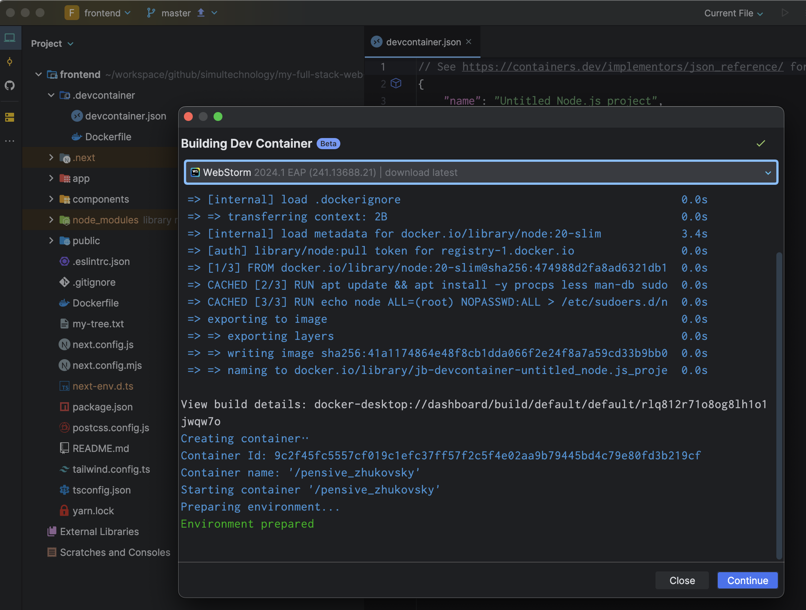
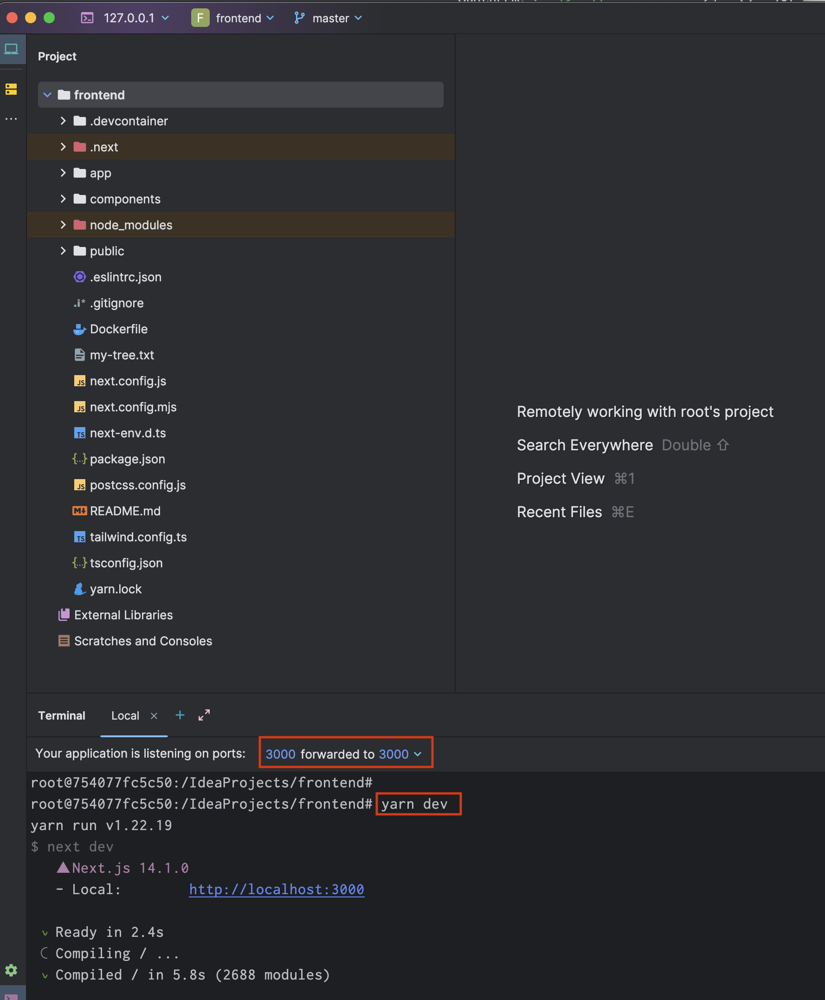

## Setup Ubuntu Environment

```sh 
multipass list

multipass launch --cpus 4 --disk 40G --memory 16G --name my-fullstack-vm 22.04
multipass mount workspace/app my-fullstack-vm:/usr/local/src/dev/app

multipass info my-fullstack-vm

# enter 
multipass shell my-fullstack-vm
```

## Using Dev Container on Jetbrains IDE

### Create a container for development from Web



[https://pleiades.io/help/idea/connect-to-devcontainer.html#create-dev-container-from-ide](https://pleiades.io/help/idea/connect-to-devcontainer.html#create-dev-container-from-ide)

### Building Dev Container



### Install dependencies

``` 
yarn create next-app frontend --ts --eslint
cp -pr frontend/* .
rm -rf frontend/

yarn add @mui/material @emotion/react @emotion/styled
yarn add @mui/x-data-grid
yarn add axios
yarn add swr
```

or 

``` 
yarn install
```

### Run the app from IDE

```
yarn dev
```



- set portforwading setting


## How to start


### start backend server

log in to backend dev container


#### run web-server

``` 
python manage.py runserver --settings config.settings.development
```

#### migrating data

``` 
python manage.py migrate --settings config.settings.development
```