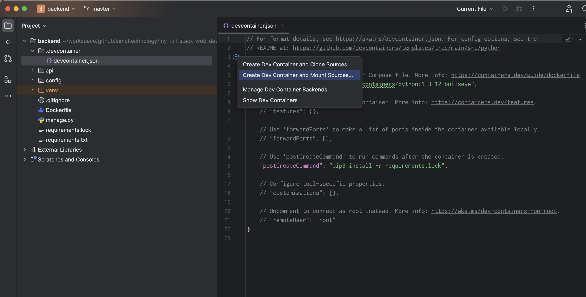
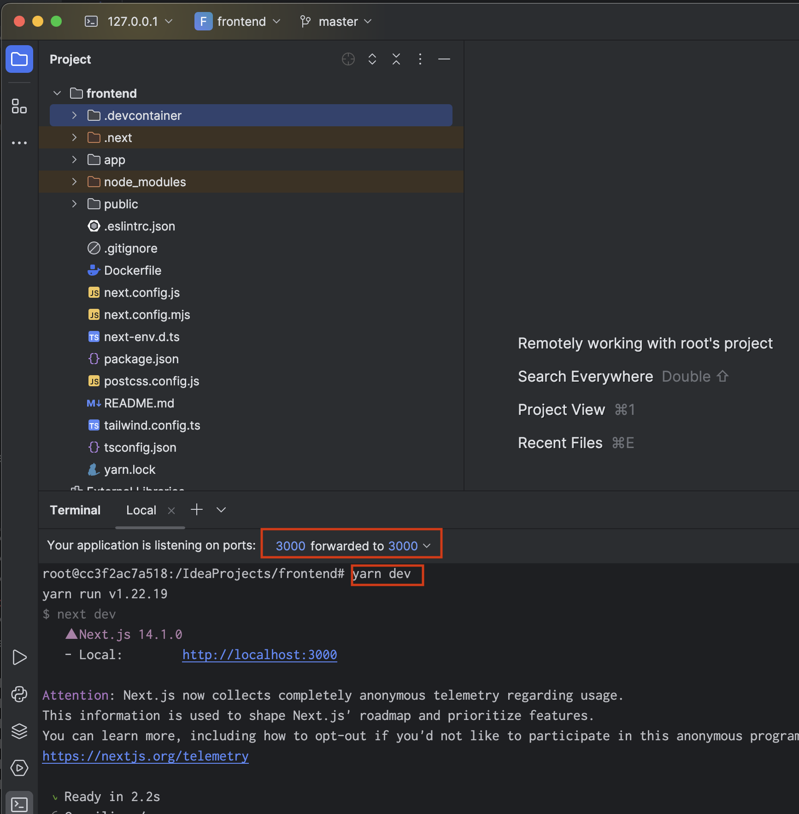

## Setup Ubuntu Environment

```sh 
multipass list

multipass launch --cpus 4 --disk 40G --memory 16G --name my-fullstack-vm 22.04
multipass mount workspace/app my-fullstack-vm:/usr/local/src/dev/app

multipass info my-fullstack-vm

# enter 
multipass shell my-fullstack-vm
```

## Using Dev Container on PyCharm

### Create a container for development from IDE



[https://pleiades.io/help/idea/connect-to-devcontainer.html#create-dev-container-from-ide](https://pleiades.io/help/idea/connect-to-devcontainer.html#create-dev-container-from-ide)

### Run the app from IDE



- set portforwading setting